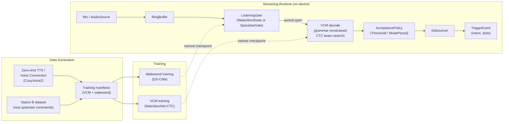

# ME2 — Process Overview

This is the hub document for ME2: a spoken-command voice-assistant pipeline built around a
grammar-constrained CTC acoustic model (VCM), fronted by a wake-word detector (DS-CNN), targeting
low-power always-on hardware (Raspberry Pi 4/5 — no such hardware physically exists on the
development node; every latency/memory number anywhere in this doc set is a same-architecture-class
CPU estimate, not a real on-device measurement).

The system in one sentence: **a DS-CNN listens for "computer"; once triggered, a ~1M-parameter
CTC model decodes speech into one of a fixed set of intents/slots, constrained to a hand-written
grammar so it can never emit an out-of-vocabulary sentence.**

Read this doc first, then the process doc for whichever stage you're touching:

| Doc | Covers |
|---|---|
| [`PROCESS-DATA-GENERATION.md`](PROCESS-DATA-GENERATION.md) | Zero-shot TTS, voice conversion, Option B dataset ingestion, the in-flight `accent-balance-fil50` rebalancing experiment |
| [`PROCESS-VCM-MODEL.md`](PROCESS-VCM-MODEL.md) | MatchboxNet-CTC architecture, training recipe, grammar→trie→decode, rejection gates, margin calibration history |
| [`PROCESS-WAKEWORD.md`](PROCESS-WAKEWORD.md) | DS-CNN dataset build, architecture, training, eval, `ListeningGate` integration |
| [`PROCESS-STREAMING-SERVING.md`](PROCESS-STREAMING-SERVING.md) | Live streaming runtime, acceptance policies, gates, VCMX combined export/serve |

These process docs tell the **narrative** (what was built, why, what the experiments found). The
authoritative technical **contract** for each feature — exact schemas, module names, invariants —
lives separately and is not duplicated here:

- `VCM-CONTRACT.md`, `OPTIONB-GRAMMAR-CONTRACT.md` — VCM/grammar internals
- `STREAMING-CONTRACT.md` — streaming runtime internals
- `WAKEWORD-DATASET-CONTRACT.md` — wakeword dataset schema/licensing
- `VCM-DATASET-COMPATIBILITY.md` — checklist for hot-swapping a new dataset into the VCM pipeline
- `INCOMPLETE-GRAMMAR-REJECTION.md` — the incomplete-prefix rejection gate's original design doc
- `BACKLOG.md` — deferred/shipped backlog items (e.g. the mode-period listening policy)
- `20260925_suggestions.md` — a proposed re-architecture spec; several of its items are already
  implemented (cross-referenced in the relevant process doc below), several are still just
  proposals — each process doc says explicitly which is which for its area.

If a process doc and a contract doc ever disagree, the contract doc (or the code it describes)
wins.

## Architecture at a glance



The wake-word gate and the VCM decoder are **sequentially gated, not both always running**: the
DS-CNN's cost is paid continuously, the CTC beam search (the expensive part) only runs once a
period is open. This is the "sequential hardware gate" design from `20260925_suggestions.md` §4,
and it's already how `vcmx-serve-wakeword` is wired — see `PROCESS-STREAMING-SERVING.md`.

## Current status at a glance (as of 2026-09-25, branch `optionb-grammar-v2`)

| Area | Status | Key number |
|---|---|---|
| VCM (Option B, `optiond` preset) | trained, calibrated | test exact-intent accuracy 97.04% pre-gate / 86.82% real-audio-scored post-gate (margin=4.0) — see `PROCESS-VCM-MODEL.md` |
| Wakeword DS-CNN | trained, wired into `ListeningGate` | val F1 0.997 (`_wakeword_`), fixed threshold 0.9 (no FAR/FRR calibration pipeline yet) |
| Streaming runtime | shipped | fp32 ONNX is the serving default (INT8 needs its own threshold re-tuning pass) |
| VCMX (combined export/serve) | shipped, reviewed, approved | treatment 25,231 rows / control 21,055 rows, speaker-disjoint |
| `accent-balance-fil50` (50/50 Filipino rebalance) | **pilot-tested, full run blocked on a decision** | sapinsapin zero-shot QA pass rate only 30.6–41.7% — see `PROCESS-DATA-GENERATION.md` |

The one open decision that blocks further progress right now is in `PROCESS-DATA-GENERATION.md`'s
"Current status / open decision" section — everything else described in this doc set is landed and
working.

## Reproducing the pipeline end to end

From `ME2/`, in order (see each process doc for what each stage does and its results):

```bash
make sync && make vendor && make download-model   # environment + CosyVoice2 checkpoint
make generate-conversions                          # voice-conversion dataset build (VCM)
make wakeword-build-dataset                         # wakeword dataset build
make optionb-train && make optionb-eval             # VCM training + eval
make wakeword-train && make wakeword-bench           # wakeword training + benchmark
make vcmx-build && make vcmx-export                  # combined export (fp32 + INT8 ONNX)
make vcmx-serve-wakeword                             # live streaming, wakeword-gated
```

Each of these has prerequisites (real datasets aren't checked into git — see
"Reference-clip consent/licensing" in `PROCESS-DATA-GENERATION.md`) and several intermediate
Makefile targets not shown here; treat this as an index of the major stages, not a literal
copy-paste script.
