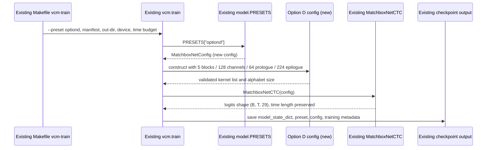

# Option D: normal-scale MatchboxCTC preset

Status: in-build

Add an `optiond` MatchboxNetCTC preset at approximately one million parameters and make it selectable through the existing training path. The resulting model will use the same CTC data flow and checkpoint format as Option C, so `make vcm-train VCM_PRESET=optiond` is the intended invocation.

## Context

### Objective

Add one model preset, parser choice, and regression coverage. Option D uses five residual time-channel-separable convolution blocks with 128 internal channels, a 64-channel prologue, a 224-channel epilogue, and kernels `[11, 13, 15, 17, 19]`; this is measured at 1,009,725 trainable parameters.

The change is small in code size but crosses the model registry, training CLI, and tests, so both diagrams are retained to make the integration contract explicit.

### Role

Strict systems architect for a PyTorch training CLI.

### User goal

Run the normal-scale model with the existing Make-based training workflow by setting `VCM_PRESET=optiond`, then receive a checkpoint with the same metadata and tensor-shape contracts as other presets.

## Data flow

Question: where does training data and preset selection go?

```mermaid
flowchart LR
    Manifest[Existing manifest.csv] --> TrainTarget[Existing Makefile vcm-train]
    Preset[VCM_PRESET=optiond] --> TrainTarget
    TrainTarget --> TrainCLI[Existing vcm.train CLI]
    TrainCLI --> Registry[PRESETS registry]
    Registry --> Config[Option D config (new)]
    Config --> Model[Existing MatchboxNetCTC]
    Manifest --> Dataset[Existing VCMDataset + feature/augmentation pipeline]
    Dataset --> Model
    Model --> Checkpoint[Existing checkpoint.pt + loss_history.json]
```

## Sequence / component flow

Question: which calls resolve Option D and produce a trainable checkpoint?



## RECAP contract

### E — Edges

- `--preset optiond` must resolve successfully through the training CLI and the generic `vcm-train` Make target; no new training algorithm or separate output format is introduced.
- Any unknown preset must continue to raise the existing `ValueError` from `build_model` and remain rejected by the CLI choices.
- The option must instantiate below a bounded normal-scale target of 950,000–1,050,000 parameters, and must be larger than Option C.
- A forward pass must preserve the input frame count and return `(B, T, ALPHABET_SIZE)` logits, so existing CTC `input_lengths` remain valid.
- The existing checkpoint metadata must identify the run as `preset: optiond` and serialize the exact Option D config used to construct the model.

### C — Contracts

```python
OPTIOND_CONFIG: MatchboxNetConfig

PRESETS: dict[str, MatchboxNetConfig]
# PRESETS["optiond"] is OPTIOND_CONFIG

def build_model(preset: str = "default") -> MatchboxNetCTC: ...
# build_model("optiond") returns MatchboxNetCTC(OPTIOND_CONFIG)

# Existing CLI contract, extended by one accepted value:
python -m me2_voicegen.vcm.train --preset optiond ...

# Existing Make contract:
make vcm-train VCM_PRESET=optiond
```

Option D's exact config is:

```python
MatchboxNetConfig(
    n_mels=40,
    n_blocks=5,
    channels=128,
    kernel_sizes=[11, 13, 15, 17, 19],
    prologue_channels=64,
    epilogue_channels=224,
)
```

### A — Assumptions and verification

- The generic Make target forwards `VCM_PRESET` unchanged: verify by inspecting the target and running `make -n vcm-train VCM_PRESET=optiond`.
- `MatchboxNetConfig.__post_init__` validates one kernel per block: verify by constructing Option D and checking its five-kernel list.
- Parameter count is determined by the current `MatchboxNetCTC` implementation: verify with `param_count(build_model("optiond"))`.
- Training and checkpoint consumers already accept arbitrary preset/config metadata: verify with the existing training, pipeline, export, and model tests; no consumer switch on a fixed preset list may be introduced.

### P — Proof

- `pytest tests/test_vcm_model.py`: Option D instantiates, is 950k–1.05M parameters, exceeds Option C, has INT8-size accounting, and preserves the forward shape/time contract.
- `pytest tests/test_vcm_train.py`: the training parser accepts `--preset optiond` without changing the existing training path.
- `make -n vcm-train VCM_PRESET=optiond`: the generated command contains `--preset optiond`.
- `uv run python -m me2_voicegen.vcm.model`: the preset inventory reports Option D at the contracted size.
- `uv run pytest`: the repository test suite passes.

Proof results:

| Command | Result |
|---|---|
| `uv run pytest tests/test_vcm_model.py tests/test_vcm_train.py` | Passed: 15 tests |
| `make -n vcm-train VCM_PRESET=optiond` | Passed: generated command contains `--preset optiond` |
| `uv run python -m me2_voicegen.vcm.model` | Passed: Option D reports 1,009,725 parameters |
| `uv run pytest` | 4,809 passed, 1 skipped, 12 deselected; 7 unrelated `test_vcm_text.py` failures because `out/conversions/v2/test_set/manifest.csv` is absent |

## Deviations

| Date | Deviation | Rationale |
|---|---|---|
| — | None | — |

## Approvals

| Date | Gate | What was approved | By whom |
|---|---|---|---|
| 2026-09-22 | Design | Option D preset, training CLI integration, Make compatibility, and proof plan | User |
