# Wakeword DS-CNN: train, export, quantize

**Status:** in-build
**Date:** 2026-09-23

## Context

- **Objective:** Add a native PyTorch DS-CNN (depthwise-separable CNN) keyword-spotting classifier for the single wakeword "computer", trained on the already-built `out/conversions/v2/wakeword/` dataset (12,204 clips, `_wakeword_`/`_unknown_`/`_silence_`). Training code (model, dataset, augmentation, training CLI) is new, scoped to `src/me2_voicegen/wakeword/`; ONNX export, INT8 quantization, and benchmarking are **not** duplicated there — they extend the existing `src/me2_voicegen/vcm/{export_onnx,benchmark}.py` modules with a model-family switch, per the user's explicit direction (2026-09-23) to defer that code to `vcm/` rather than vendoring the handoff doc's suggested Honk repo or writing a second copy. Medium-large: new model registry, dataset loader, VAD-anchored windowing/augmentation policy, training CLI, extended export/quantize/benchmark, Makefile targets, tests — both diagrams earn their place.
- **Role:** Strict systems architect for a PyTorch audio-classification training CLI, extending this repo's existing TTS/VCM training stack conventions.
- **User goal:** Run `make wakeword-train` to produce a checkpoint (mirroring `make vcm-train`), then `make wakeword-export`/`wakeword-bench` (routed through the extended `vcm.export_onnx`/`vcm.benchmark` CLIs) to get an INT8 ONNX model sized/timed for a Raspberry Pi 4 (2018, 4GB RAM) demo device, with results tracked the same way VCM's are (`checkpoint.pt`, `loss_history.json`, `metadata/eval_report.{json,md}`).
- **Source:** user-pasted "Wakeword Detection Pipeline Handoff" doc (this conversation, 2026-09-23); `docs/WAKEWORD-DATASET-CONTRACT.md`; `out/conversions/v2/wakeword/{manifest.csv,summary.md}`; `src/me2_voicegen/vcm/{model.py,train.py,export_onnx.py,benchmark.py}` as the pattern being extended; user's 2026-09-23 amendment round (below) resolving all five design-gate questions from the prior draft.

### Design-gate amendments (2026-09-23, resolved — prior draft's five open questions)

1. **Honk:** not vendored at all, not even for training code as first proposed. Only its DS-CNN topology is used as reference; export/quantize/benchmark are deferred to the existing `vcm/` modules (extended, not duplicated) per user direction.
2. **"MLOps Projects":** dropped. This feature tracks itself via this SPEC.md plus `out/wakeword/.../metadata/eval_report.md`, same as `option-d-model`.
3. **Clip duration:** user confirmed by inspecting the raw (pre-conversion) files directly — clips run ~3s because of silence padding at the start/end around the spoken word, not because the word itself is long. Resolved below via VAD-anchored windowing instead of a plain crop/pad policy (see Edges/Contracts) — this replaces the prior draft's "random crop over the full clip" plan, which risked landing a `_wakeword_`-labeled training window entirely on the padding with no speech in it.
4. **Data collection:** confirmed out of scope — train on `out/conversions/v2/wakeword/manifest.csv` as it exists today.
5. **Target hardware:** confirmed as **Raspberry Pi 4 (2018), 4GB RAM** (Broadcom BCM2711, quad-core Cortex-A72). No physical unit is attached to this dev node, so `vcm/benchmark.py`'s existing `NOT_MEASURED_ON` caveat — which already reads *"Raspberry Pi 4/5 (no such hardware exists on this node)"*, written before this conversation — applies unchanged; wakeword benchmark output additionally records the confirmed model (RPi 4, not 5) and RAM size as informational context. The handoff doc's MLPerf Tiny latency figures (182ms on "standard MCU") don't directly translate to a general-purpose SBC like the RPi4 either, so budgets stay indicative-only, consistent with `benchmark.py`'s existing `SPEC_BUDGETS_INDICATIVE_ONLY` framing.

### Design-gate amendments (round 2, 2026-09-23) — VAD strategy revised from per-sample to source-derived-and-mapped

User's proposal: rather than running VAD live on each training sample (round 1's design), derive the speech span once from each clip's *cleanest available ancestor* and propagate it through the dataset-build pipeline's own provenance columns (`group_id`, `ref_voice`) — offered as an alternative to regenerating the whole `_wakeword_` positive pipeline (VAD-trim raw audio → persona conversion → noise mixing) from scratch.

This was checked empirically against the real built dataset before accepting it, not assumed:

- **Voice conversion (`positives_real` → `positives_converted`) duration drift**, measured across all 3,744 converted rows joined back to their source via `group_id`: mean 11ms, max 64ms, zero rows over 100ms. `synthesizer.convert_voice` (content-preserving VC, explicitly not TTS resynthesis per `convert_positives.py`'s own docstring) does not materially shift timing.
- **Noise mixing (`apply_noise`, used identically by `mix_background_noise.py` for both `positives_converted_noisy` and `adversaries_noisy`) duration drift**, measured across all 1,280 `positives_converted_noisy` rows joined to their immediate `positives_converted` parent via `(group_id, ref_voice)`: **exactly 0.0s for every row** — additive mixing never changes sample count, confirming this from real data rather than only from reading `apply_noise`'s "loop/trim noise to target_len" logic. This is the empirical backing for the documentation note the user asked for: **noise mixing does not alter clip timing/content, so a span detected before mixing remains exactly valid after it.**

Conclusion: source-derive-and-map is adopted, **full positives regeneration is not needed** — see Edges/Contracts below for the mechanism (a one-time `derive_speech_spans.py` pass, not a per-training-sample VAD call). `common_voice_negative_sample` is already raw/unconverted/un-noised, so it needs no mapping at all — VAD runs on it directly, as itself its own ancestor.

### Design-gate amendments (round 3, 2026-09-23) — `adversaries`/`adversaries_noisy` dropped from the precompute pipeline

User asked specifically about `adversaries_noisy`: given `_unknown_` content has a lower mislabeling risk than `_wakeword_` if VAD misfires (a bad crop on a decoy clip almost always still lands on genuinely-not-"computer" content; a bad crop on a `_wakeword_` clip risks teaching the model "silence = computer"), is live/dynamic VAD acceptable there instead of precompute-and-map, trading a bounded loss in near-miss training signal quality for avoiding the round-2 filename-parsing join workaround (`adversaries_noisy`'s blank `ref_voice` column)?

Checked empirically before deciding (`torchaudio.functional.vad` run against the real files, not assumed):

| Subset | Empty-span (fallback-to-center-crop) rate |
|---|---|
| `positives_real` (100-row sample) | 5% |
| `adversaries` (all 245 rows) | 54.3% |
| `adversaries_noisy` (all 75 rows) | 45.3% |
| `common_voice_negative_sample` (100-row sample) | 53% |

Noise is **not** the dominant driver of VAD misses here — the clean `adversaries` parent already misses on ~54% of rows (default SoX-VAD parameters cope poorly with short TTS-synthesized clips generally, independent of noise). That undercuts precomputing-and-mapping's own value proposition for this subset: it wouldn't have produced meaningfully cleaner anchoring for roughly half these rows even before noise entered the picture, so it isn't worth the filename-parsing join fragility. `positives_real` — the class where a misfire is actually costly — sits at 5%, which is the number this design actually needs to hold up.

**Decision:** `adversaries` and `adversaries_noisy` (both `_unknown_`) are dropped from `derive_speech_spans.py` entirely — no join, no filename parsing. Both go through `WakewordDataset`'s existing live-VAD-with-center-crop-fallback path unconditionally (not as a rare edge case there — it's the common case for this pair, and that's fine given the class-asymmetric mislabeling risk above). `derive_speech_spans.py`'s scope narrows to the `_wakeword_` chain (`positives_real` → `positives_converted` → `positives_converted_noisy`, where the risk is real and VAD is reliable) plus caching `common_voice_negative_sample` directly (large row count, worth computing once rather than per-epoch, but a trivial 1:1 case — it's already its own ancestor, no join needed).

## Diagrams

### Data flow

Question: how does audio data flow from the already-built dataset to a deployable INT8 ONNX wakeword model?

```mermaid
flowchart LR
    Ancestors[positives_real / common_voice_negative_sample manifests existing] --> Derive[derive_speech_spans.py new, one-time offline pass]
    Derive --> VADRun[torchaudio.functional.vad new usage]
    VADRun --> Cols[speech_start_s/speech_end_s extension columns new, written into positives_real/positives_converted/positives_converted_noisy/common_voice_negative_sample only, via group_id+ref_voice join for the wakeword chain]
    Cols --> Manifest[manifest.csv existing, now carrying the new columns]
    Adversaries[adversaries / adversaries_noisy manifests existing, NOT in the precompute pipeline -- see Edges] --> Dataset
    Manifest --> Dataset[WakewordDataset new]
    Dataset --> Shift[window crop anchored to precomputed span when present, else live VAD -> center-crop fallback new]
    Shift --> Noise[Augmenter noise existing, p_rir=0]
    Noise --> Feat[LogMelFeatureExtractor existing]
    Feat --> Model[DSCNN new]
    Model --> Ckpt[checkpoint.pt + loss_history.json new, vcm pattern]
    Ckpt --> ExportFP32[vcm.export_onnx.export_fp32 existing, extended for model-family]
    ExportFP32 --> ONNXFP32[wakeword_fp32.onnx new artifact]
    ONNXFP32 --> Quantize[vcm.export_onnx.quantize_int8_static existing, extended calibration reader]
    Quantize --> ONNXINT8[wakeword_int8.onnx new artifact]
    ONNXINT8 --> Bench[vcm.benchmark existing, extended for model-family]
```



### Sequence / component

Question: which calls turn `make wakeword-train` and `make wakeword-export` into a trained, quantized checkpoint?

```mermaid
sequenceDiagram
    participant Make as Makefile (new wakeword-* targets)
    participant Derive as wakeword.derive_speech_spans CLI (new, one-time)
    participant Train as wakeword.train CLI (new)
    participant DS as WakewordDataset (new, reads precomputed span columns)
    participant Feat as LogMelFeatureExtractor (existing)
    participant Net as DSCNN (new)
    participant Disk as checkpoint output (new, vcm layout)
    participant Export as vcm.export_onnx CLI (existing, --model-family wakeword)
    participant ORT as onnxruntime.quantization (existing lib)

    Make->>Derive: (run once, before first training run)
    Derive->>Derive: VAD on positives_real/common_voice_negative_sample; join+copy span onto positives_converted/positives_converted_noisy via group_id(+ref_voice). adversaries/adversaries_noisy intentionally excluded (Edges).
    Derive-->>Make: manifest.csv files rewritten in place with speech_start_s/speech_end_s (4 of 6 non-silence subsets)
    Make->>Train: --manifest, --out-dir, --preset, --device, --seed
    Train->>DS: load split row, crop+shift+noise-augment waveform around its speech_start_s/speech_end_s when present; else run live VAD (always true for adversaries/adversaries_noisy) -> center-crop fallback if that's also empty
    DS-->>Train: waveform, label
    Train->>Feat: waveform -> (40, T) log-mel
    Feat-->>Train: features
    Train->>Net: forward(features)
    Net-->>Train: (B, 3) logits
    Train->>Disk: checkpoint.pt, loss_history.json, eval_report.{json,md}
    Make->>Export: --model-family wakeword --checkpoint --out-dir
    Export->>Net: rebuild DSCNN, load state_dict (family-dispatched loader)
    Export->>ORT: torch.onnx.export -> fp32 graph, static (B,3) output
    ORT-->>Export: wakeword_fp32.onnx
    Export->>ORT: quantize_int8_static(fp32, WakewordCalibrationReader)
    ORT-->>Export: wakeword_int8.onnx
```

## RECAP

### E — Edges

| Edge | Behavior |
|---|---|
| `_wakeword_`/`_unknown_` clip with leading/trailing silence padding (confirmed by the user against the raw, pre-conversion files — most of the ~3s clip is padding around a short spoken word/phrase) | `derive_speech_spans.py` locates the speech region **once, offline**, via `torchaudio.functional.vad` (forward pass trims leading silence; reversed-waveform pass trims trailing silence) run only on each clip's cleanest ancestor (below), then writes `speech_start_s`/`speech_end_s` into that ancestor's manifest and, via a `group_id`(+`ref_voice`) join, into every derived/noisy sibling's manifest too — no VAD is run on noisy or voice-converted audio directly. `WakewordDataset` reads those columns and anchors its crop window to the span plus a fixed `SPAN_MARGIN_SECONDS = 0.15` of context on each side. This fixes the failure mode of the original per-sample-crop plan (a naive crop could land entirely on padding for a `_wakeword_`-labeled clip) without the earlier round's downside of running VAD directly on artifact/noise-degraded audio. |
| Which subset is precomputed-and-mapped vs. left on the live-VAD path | Precomputed (`derive_speech_spans.py`): `_wakeword_`'s `positives_real` (raw recording, the actual source) → `positives_converted` → `positives_converted_noisy`, plus `_unknown_`'s `common_voice_negative_sample` (already raw/unconverted/un-noised — it is its own ancestor, cached once for performance given its large row count, no join needed). Left on `WakewordDataset`'s live-VAD-with-fallback path, unconditionally: `_unknown_`'s `adversaries`/`adversaries_noisy` — see the round-3 empirical finding above (54.3%/45.3% VAD-empty even before noise is the issue, which sinks precompute-and-map's value here; and a misfire on `_unknown_` content is low-risk, unlike on `_wakeword_`). `_silence_`: skipped entirely (synthetic silence, `generate_silence.py`), never VAD'd at all. |
| Join key for propagating a span onto a derived sibling (wakeword chain only) | `positives_real` → `positives_converted`: `group_id` (validated: 3,744/3,744 converted rows join cleanly, max duration drift 64ms — absorbed by `SPAN_MARGIN_SECONDS`). `positives_converted` → `positives_converted_noisy`: `(group_id, ref_voice)` (validated: 1,280/1,280 rows join cleanly, **exactly 0.0s duration drift** — additive noise mixing is provably timing-exact). No join exists for `adversaries`/`adversaries_noisy` (round 3) — in particular, `adversaries_noisy`'s own `ref_voice` manifest column being blank for every row (the actual ref voice is only embedded in the filename) is now moot; it doesn't need parsing since that subset was dropped from the precompute pipeline entirely. |
| A join fails outright (no matching ancestor row), or the mapped span's end exceeds the derived file's own measured `duration` by more than `SPAN_MARGIN_SECONDS` (defensive check — covers any future subset where the drift assumption above doesn't hold) | `derive_speech_spans.py` leaves that row's `speech_start_s`/`speech_end_s` empty rather than writing a wrong value; `WakewordDataset` falls back to live per-sample `torchaudio.functional.vad` on that specific row. `positives_real`/`positives_converted`/`positives_converted_noisy` (`RARE_FALLBACK_SUBSETS`) log one warning line per occurrence — a fallback there is genuinely rare (~2-3%, measured against the real dataset), actionable signal, not spam. `adversaries`/`adversaries_noisy` (live VAD by design) and `common_voice_negative_sample` (precomputed-eligible, but its own natural VAD-empty rate measured at ~55% once this pipeline actually ran against the real data — see the implementation deviation below) get aggregate-only logging instead (`WakewordDataset.log_fallback_summary()`, once per epoch) — per-row warnings for a subset that fails roughly half the time would be pure noise, an accepted, bounded weakening of signal quality for those rows, not a defect. |
| Clip shorter than `WAKEWORD_WINDOW_SECONDS` after span+margin (min observed clip 0.24s) | Zero-pad to the window length; pad position randomized at train time (this is also where the "temporal shifting" augmentation the handoff doc asked for actually happens), centered at eval/export/calibration time. |
| Manifest row with an empty `split` for the requested split filter | Raise `ValueError` at dataset-construction time — the contract (`WAKEWORD-DATASET-CONTRACT.md` §2) says ticket 04 populates `split` for every row of the final assembled `manifest.csv`; an empty value here means the wrong (pre-ticket-04) manifest was pointed at, not a value to silently skip. |
| Unknown `--preset` value | Raise the same `ValueError` pattern as `vcm.model.build_model`; CLI `argparse` choices reject it before that point too. |
| Dataset license (`*_noisy` rows present in the final manifest) | Every checkpoint and `eval_report.json`/`.md` this CLI writes carries a `LICENSE_NOTE` stating CC-BY-NC-SA-4.0 encumbrance (non-commercial, share-alike), identical in spirit to `vcm/train.py`'s existing `LICENSE_NOTE` — copied from `out/conversions/v2/wakeword/summary.md`'s License section, not re-derived. |
| Class imbalance (`_silence_` is 10% vs. 45%/45%) | No oversampling/reweighting added by this feature — the dataset build already stratifies the split; `eval_report` reports per-class precision/recall/F1 so imbalance effects are visible, not hidden behind overall accuracy. |
| Honk vendoring/reuse (handoff doc's ask) | Not done in any form — no vendored code, no new git submodule, no new pinned dependency, and (per amendment 1) not even used as a training-code reference. Only its DS-CNN topology description informs `DSCNNConfig`. |
| Export/quantize/benchmark code location (handoff doc assumed a from-scratch pipeline) | Not written as new `wakeword/` modules — `vcm/export_onnx.py` and `vcm/benchmark.py` are extended with a `--model-family {vcm,wakeword}` switch instead, per amendment 1. `wakeword/` owns only training-time code (model, dataset, augment, train). |
| VAD dependency for speech-span detection (handoff doc pointed at `simple-audio-transcriber`'s VAD filter) | Not used — that tool's VAD is a side effect of loading a full `faster-whisper` ASR model (`vad_filter=True` on `.transcribe()`), which would add a new, heavy external dependency to this repo just to get silence boundaries. `torchaudio.functional.vad` (SoX-style energy VAD) does the same job and is already a pinned dependency (`torchaudio==2.3.1`) — zero new installs, no ASR compute. |
| Fresh classroom audio collection (handoff doc's ask) | Not done — see amendment 4. Non-goal: this feature trains only on `out/conversions/v2/wakeword/manifest.csv` as it exists today. |

### C — Contracts

```python
# src/me2_voicegen/wakeword/model.py
LABELS: tuple[str, str, str] = ("_wakeword_", "_unknown_", "_silence_")
LABEL_TO_ID: dict[str, int]  # {"_wakeword_": 0, "_unknown_": 1, "_silence_": 2}

@dataclasses.dataclass
class DSCNNConfig:
    n_mels: int = 40          # matches LogMelFeatureExtractor's fixed N_MELS
    n_classes: int = 3
    n_blocks: int
    channels: int
    kernel_sizes: list[tuple[int, int]]

class DSCNN(nn.Module):
    def forward(self, x: torch.Tensor) -> torch.Tensor: ...  # (B, 40, T) -> (B, 3) logits

PRESETS: dict[str, DSCNNConfig]
def build_model(preset: str = "default") -> DSCNN: ...
def param_count(model: nn.Module) -> int: ...
def estimated_int8_bytes(model: nn.Module) -> int: ...

# src/me2_voicegen/wakeword/derive_speech_spans.py (new, one-time offline pass -- not run per training epoch)
SPAN_MARGIN_SECONDS: float = 0.15
SPAN_COLUMNS: tuple[str, str] = ("speech_start_s", "speech_end_s")  # extension columns per
                                                                      # WAKEWORD-DATASET-CONTRACT.md section 2

def detect_speech_span(waveform: torch.Tensor, sample_rate: int) -> tuple[float, float] | None:
    ...  # (start_s, end_s) via torchaudio.functional.vad forward + reversed-waveform pass;
         # None if detection collapses to empty.

def main(argv: list[str] | None = None) -> None:
    ...
    # 1. positives_real, common_voice_negative_sample: run detect_speech_span on every row, write
    #    speech_start_s/speech_end_s into that subset's own manifest.csv.
    # 2. positives_converted (join: group_id), positives_converted_noisy (join: group_id+ref_voice):
    #    copy the ancestor's span into the derived row's manifest.csv, after a sanity check
    #    (mapped end <= derived row's own duration + SPAN_MARGIN_SECONDS); leave the columns empty
    #    on any row that fails the join or the sanity check.
    # 3. adversaries, adversaries_noisy: untouched, no columns added -- left on WakewordDataset's
    #    live-VAD-with-fallback path unconditionally (round 3: precompute doesn't pay for itself here).
    # 4. silence_synthetic: untouched, no columns added, never VAD'd.
# CLI: python -m me2_voicegen.wakeword.derive_speech_spans --wakeword-root out/conversions/v2/wakeword

# src/me2_voicegen/wakeword/dataset.py
WAKEWORD_WINDOW_SECONDS: float = 1.5

class WakewordDataset(torch.utils.data.Dataset):
    def __init__(
        self,
        manifest_path: str | Path,
        split: str,
        window_seconds: float = WAKEWORD_WINDOW_SECONDS,
        augmenter: "me2_voicegen.common.augment.Augmenter | None" = None,
        shift: bool = False,
        generator: torch.Generator | None = None,
    ) -> None: ...
    def __getitem__(self, idx: int) -> dict:  # {"waveform": Tensor[window_samples], "label": int}
    # crops around row["speech_start_s"]/["speech_end_s"] when present; else calls
    # derive_speech_spans.detect_speech_span on that row's own waveform as a live fallback
    # (Edges table) and center-crops the full clip if that also comes back empty.

def collate_fn(
    batch: list[dict], feature_extractor: "me2_voicegen.common.features.LogMelFeatureExtractor"
) -> dict:  # {"features": Tensor[B, 40, T], "labels": Tensor[B]}

# src/me2_voicegen/wakeword/augment.py
def shift_waveform(
    waveform: torch.Tensor, window_samples: int, generator: torch.Generator
) -> torch.Tensor: ...  # never moves signal outside [0, window_samples)

# src/me2_voicegen/wakeword/train.py
LICENSE_NOTE: str
DEFAULT_MANIFEST = Path(".../out/conversions/v2/wakeword/manifest.csv")
# CLI:
# python -m me2_voicegen.wakeword.train --manifest <path> --out-dir <path>
#   --preset default --device cpu --max-minutes N --seed 0
# writes:
#   <out-dir>/checkpoints/checkpoint.pt        (model_state_dict, preset, config, LICENSE_NOTE)
#   <out-dir>/metadata/loss_history.json
#   <out-dir>/metadata/eval_report.json
#   <out-dir>/metadata/eval_report.md

# src/me2_voicegen/vcm/export_onnx.py (existing module, extended -- no new wakeword/export_onnx.py)
def load_checkpoint(checkpoint_path: str | Path, model_family: str = "vcm") -> tuple[nn.Module, dict]: ...
# family="wakeword" branch imports me2_voicegen.wakeword.model lazily (vcm does not
# gain a hard top-level dependency on wakeword); family="vcm" keeps today's behavior byte-for-byte.

def export_fp32(
    model: nn.Module,
    out_path: str | Path,
    n_frames: int | None = None,
    output_names: list[str] = ["logits"],
    dynamic_axes: dict | None = None,   # None -> {"features": {0: "batch", 2: "time"}} only;
) -> Path: ...                          # vcm's CTC call site additionally dynamic-axes "logits" dim 1 ("time"),
                                          # wakeword's call site passes dynamic_axes=None (static (B, 3) output)

class WakewordCalibrationReader:  # sibling to the existing ValSplitCalibrationReader, built from
    ...                            # wakeword.dataset.WakewordDataset instead of vcm.dataset.VCMDataset

def quantize_int8_static(fp32_path, int8_path, calibration_reader) -> Path: ...  # unchanged, already generic

# CLI (new flag on the existing parser):
# python -m me2_voicegen.vcm.export_onnx --model-family {vcm,wakeword} --checkpoint <path> --out-dir <path>

# src/me2_voicegen/vcm/benchmark.py (existing module, extended -- no new wakeword/benchmark.py)
# `benchmark_session`, `_make_session`, `_render_markdown`, RSS/latency measurement: reused unchanged,
# already model-agnostic (operate on an onnxruntime session + n_frames only).
# `load_checkpoint`/`window_n_frames`/dummy-input construction: family-dispatched, same as export_onnx.py.
# `NOT_MEASURED_ON` already reads "Raspberry Pi 4/5 (no such hardware exists on this node)" --
# unchanged; wakeword's result JSON additionally records target_device="Raspberry Pi 4 (2018), 4GB RAM".
# CLI:
# python -m me2_voicegen.vcm.benchmark --model-family {vcm,wakeword} --checkpoint <path> --out-dir <path>
```

`docs/WAKEWORD-DATASET-CONTRACT.md` addendum (this feature updates that doc, per its own header: "if this doc and that module ever disagree, the module wins and this doc is stale and needs fixing" — so the doc gets a section 8 alongside adding the module):

- New optional extension columns (section 2's mechanism): `speech_start_s`, `speech_end_s`, written by `derive_speech_spans.py`, present on `positives_real`/`common_voice_negative_sample` and propagated onto `positives_converted`/`positives_converted_noisy` only; absent everywhere else, including `adversaries`/`adversaries_noisy` (round 3: intentionally excluded, not an oversight).
- Records the measured facts above as dataset-level provenance, not just training-feature trivia: VC duration drift (mean 11ms/max 64ms), noise-mixing duration drift (exactly 0.0s), and per-subset VAD empty-span rates (`positives_real` 5%, `adversaries` 54.3%, `adversaries_noisy` 45.3%, `common_voice_negative_sample` 53%) — future features touching this dataset can rely on them without re-deriving.

### A — Assumptions

| Assumption | Verified when / how |
|---|---|
| `out/conversions/v2/wakeword/manifest.csv`'s `split` column is populated for every row | `WakewordDataset.__init__` raises if any row matching the requested `split` has an empty value; a unit test asserts this on the real manifest header/sample. |
| `LogMelFeatureExtractor` (40 mel, 10ms hop, 30ms window, 16kHz) is reusable unmodified for a fixed `WAKEWORD_WINDOW_SECONDS` window | Unit test constructs it and checks output shape `(40, T)` for a `WAKEWORD_WINDOW_SECONDS`-length dummy waveform. |
| `common.augment.Augmenter(p_rir=0.0, p_noise=...)` fully disables RIR while keeping the existing 5–25dB dynamic-SNR noise mixing | Unit test asserts `rir_pool` is never touched / output is identical to the un-augmented waveform when only `p_rir=0.0` varies. |
| `torchaudio.functional.vad` (forward + reversed-waveform pass) correctly locates speech within a silence-padded clip, at a rate that justifies precomputing for a given subset | **Already measured against the real dataset**, per-subset empty-span rate: `positives_real` 5% (100-row sample), `adversaries` 54.3% (all 245), `adversaries_noisy` 45.3% (all 75), `common_voice_negative_sample` 53% (100-row sample). This directly drove the round-3 decision to precompute only `positives_real`/wakeword-chain/`common_voice_negative_sample` and leave `adversaries`/`adversaries_noisy` on the live-VAD path. Unit test on a synthetic waveform (zeros + sine burst + zeros, known bounds) asserts the detected span matches expected onset/offset within a small tolerance. |
| Voice conversion (`positives_real` → `positives_converted`, via `synthesizer.convert_voice`) preserves clip timing closely enough that a source-derived span remains valid after conversion | **Already measured against the real dataset** (not just assumed): all 3,744 converted rows join to their source via `group_id`; duration drift mean 11ms, max 64ms — comfortably inside `SPAN_MARGIN_SECONDS = 0.15`. `derive_speech_spans.py` re-runs this same check as its per-row sanity gate (Edges table), so any future drift regression fails closed (empty columns, live-VAD fallback) rather than silently mis-cropping. |
| Additive noise mixing (`apply_noise`, shared by `mix_background_noise.py` for both `positives_converted_noisy` and `adversaries_noisy`) does not shift clip timing/content — **the documentation note the user asked for** | **Already measured against the real dataset**: all 1,280 `positives_converted_noisy` rows joined to their immediate `positives_converted` parent via `(group_id, ref_voice)` show **exactly 0.0s duration drift**. Recorded in `docs/WAKEWORD-DATASET-CONTRACT.md` (this feature's addendum, Contracts below) so it's visible to anyone reading the dataset contract, not just this SPEC. (This is exactly why noise-mixing isn't the reason `adversaries_noisy` was left on the live-VAD path in round 3 — its clean `adversaries` parent already misses just as often.) |
| `onnxruntime.quantization`'s static INT8 API (already used by `vcm/export_onnx.py`) works unchanged for a fixed-shape single-input classifier graph (no dynamic time axis on the output, unlike vcm's CTC graph) | Extended `quantize_int8_static` output loads via `onnxruntime.InferenceSession` and produces a `(1, 3)` output for a `(1, 40, T)` input, for `--model-family wakeword`. |
| Generalizing `vcm/export_onnx.py`/`vcm/benchmark.py` for a second model family does not change today's `--model-family vcm` (default) behavior | Existing `tests/test_vcm_export.py` continues to pass unmodified after the refactor. |
| No new third-party dependency is required — torch, torchaudio, librosa, numpy, onnx, onnxruntime, soundfile are already pinned in `pyproject.toml`; `torchaudio.functional.vad` needs nothing beyond `torchaudio` itself | `git diff pyproject.toml` shows no `[project.dependencies]` change after this feature lands. |

### P — Proof

| # | Test / integration path / mock scenario | Command | Result |
|---|---|---|---|
| 1 | DS-CNN presets instantiate; forward pass returns `(B, 3)` for `(B, 40, T)` input; param/INT8-size accounting | `pytest tests/test_wakeword_model.py` | Passed: 7 tests |
| 2 | `detect_speech_span` on synthetic + real clips; join+propagation logic (`group_id`, `(group_id, ref_voice)`) on fixture manifests covering the wakeword chain + `common_voice_negative_sample`; sanity-gate rejects an intentionally-corrupted row (mapped end past duration) into the empty/fallback path; confirms `adversaries`/`adversaries_noisy` manifests are left untouched (no `speech_start_s`/`speech_end_s` columns added) | `pytest tests/test_wakeword_derive_speech_spans.py` | Passed: 7 tests |
| 3 | Windowing: precomputed-span-anchored crop/pad when present; unconditional live-VAD-then-center-crop path for `adversaries`/`adversaries_noisy` rows (no precomputed column to read); aggregate (not per-row) fallback logging for that pair *and* `common_voice_negative_sample` (round-3 deviation below) vs. per-row warnings for the wakeword chain; split filtering; label-to-id mapping | `pytest tests/test_wakeword_dataset.py` | Passed: 9 tests |
| 4 | Temporal shift never moves signal outside the window; `center_window` is deterministic | `pytest tests/test_wakeword_augment.py` | Passed: 6 tests |
| 5 | Training CLI parses args; `run_eval`/`per_class_metrics` wiring correct on synthetic tensors; one real short training pass (1 epoch) on a tiny fake manifest writes checkpoint/loss_history/eval_report with `LICENSE_NOTE` present | `pytest tests/test_wakeword_train.py` | Passed: 6 tests |
| 6 | `--model-family wakeword` FP32 export matches PyTorch logits within tolerance; INT8 quantized export loads and infers at `(1,3)`; existing `--model-family vcm` (default) path unchanged | `pytest tests/test_vcm_export.py` (extended with wakeword-family cases, not a new `test_wakeword_export.py`) | Passed: 14 fast (all, no onnx touch) + 6 slow, 5 passed / 1 skipped (the real-wakeword-checkpoint test — expected skip, since no permanent `out/wakeword/checkpoints/checkpoint.pt` exists yet; item 11 below exercises this same path against a real, non-permanent checkpoint instead) |
| 7 | Same family-dispatch extension for benchmarking; `NOT_MEASURED_ON`/RPi4 labeling present in wakeword output | `pytest tests/test_vcm_export.py` (already covers `vcm.benchmark`, extended with wakeword-family cases — no new file) | Covered by item 6 (same file) |
| 8 | Real dataset run: `derive_speech_spans.py` against `out/conversions/v2/wakeword/`, reporting join-success rate per subset | `python -m me2_voicegen.wakeword.derive_speech_spans --wakeword-root out/conversions/v2/wakeword` | Passed: `positives_real` 468 rows/2.6% empty, `common_voice_negative_sample` 5172 rows/54.9% empty, `positives_converted` 3744 rows/3648 mapped (96 missing-join, traced to the 12 unspannable `positives_real` rows × up to 8 variants each), `positives_converted_noisy` 1280 rows/1249 mapped, 0 failed-sanity anywhere |
| 9 | Generated Make commands match the CLI contract | `make -n wakeword-derive-spans`, `make -n wakeword-train`, `make -n wakeword-export`, `make -n wakeword-bench` | Passed: all 4 generate the expected command |
| 10 | No regression | `uv run pytest` | Passed: 5020 passed, 17 deselected (slow), 0 failed |
| 11 (beyond the original plan, added once real training was possible) | `make wakeword-build-dataset` re-run carries the new `speech_start_s`/`speech_end_s` columns into the final manifest with the identical 12,204-row/train-val-test split as before (seed=0 determinism); a real 2-epoch smoke-training run (`--max-minutes 3 --max-epochs 2`, out-dir outside the repo) on the actual dataset completes and writes all expected outputs; `vcm.export_onnx --model-family wakeword` and `vcm.benchmark --model-family wakeword` run against that real checkpoint end to end | manual runs (`make wakeword-build-dataset`; `python -m me2_voicegen.wakeword.train --max-minutes 3 --max-epochs 2 ...`; `python -m me2_voicegen.vcm.export_onnx --model-family wakeword ...`; `python -m me2_voicegen.vcm.benchmark --model-family wakeword ...`) | Passed: rebuilt manifest kept the exact same per-label split counts (`_wakeword_` 3845/1097/550, `_unknown_` 3844/1099/549, `_silence_` 815/270/135); training wrote checkpoint/loss_history/eval_report; real INT8 model = 49,576 bytes (~48.4 KiB — inside the handoff doc's own cited 38.6-52.5 KB MLPerf Tiny range) |

## Deviations

| Date | Deviation | Minor: rationale / Material: design-gate re-run |
|---|---|---|
| 2026-09-23 | `build_dataset.py`'s `EXTENSION_FIELDS` needed `speech_start_s`/`speech_end_s` added, or the final assembled `manifest.csv` silently drops those columns on rebuild (`EXTENSION_FIELDS` is a hardcoded whitelist, not an auto-passthrough). | Minor: an unstated-but-required file for the RECAP's own stated goal (propagate spans into the manifest the training CLI actually reads); no new Edge/Contract, just a necessary implementation-time file this SPEC hadn't named. Caught by actually running the real pipeline end to end, not by a unit test. |
| 2026-09-23 | `common_voice_negative_sample` was assigned per-row fallback-warning logging in the original design (grouped with the wakeword chain), but running `derive_speech_spans.py` against the real dataset measured its natural VAD-empty rate at ~55% — comparable to `adversaries`', not "rare." Moved to aggregate-only logging (new `RARE_FALLBACK_SUBSETS`, narrower than `PRECOMPUTED_SUBSETS`); discovered only by actually running the real training smoke test, which printed thousands of per-row warnings for this subset. | Minor: pure logging-verbosity fix, does not change what data reaches the model, windowing behavior, or any Contract signature — `PRECOMPUTED_SUBSETS` (join/precompute eligibility) is unchanged. |

## Approvals

| Date | Gate | What was approved / decided | By |
|---|---|---|---|
| 2026-09-23 | Design | DS-CNN training pipeline (model/dataset/augment/train, scoped to `wakeword/`); export/quantize/benchmark deferred to extended `vcm/` modules; source-derived VAD span mapping via `derive_speech_spans.py` for the `_wakeword_` chain + `common_voice_negative_sample`; `adversaries`/`adversaries_noisy` left on live-VAD-with-fallback; RPi4 (2018, 4GB) target hardware; full RECAP as amended across three rounds | User |
