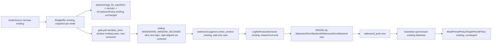
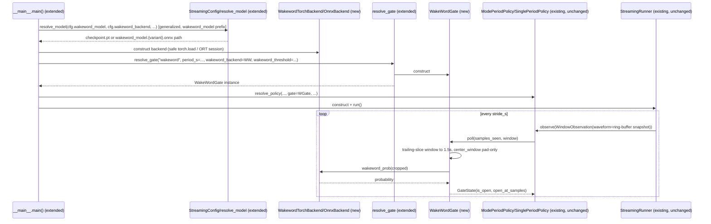

# Wakeword Gate: wire the trained DS-CNN into the `ListeningGate` seam

**Status:** in-build
**Date:** 2026-09-24

## Context

- **Objective:** Replace the manual spacebar press with the already-trained wakeword DS-CNN (feature `wakeword-dscnn`) as a real `ListeningGate` implementation, so `--gate wakeword` opens a bounded listening period when the model detects the wakeword in the live ring-buffer audio — with zero changes to `AcceptancePolicy`/`StreamingRunner`, exactly as `docs/STREAMING-CONTRACT.md` section 6 designed the seam to allow.
- **Role:** Strict systems architect extending this repo's existing streaming CLI/registry conventions (`vcm/streaming/{gate,config,__main__,backends}.py`) with a second, classifier-shaped inference backend family, following the same `--model-family`-style dispatch pattern `vcm/export_onnx.py`/`vcm/benchmark.py` already established for the wakeword model.
- **User goal:** Run `make stream-wakeword` (or `--gate wakeword` on the streaming CLI directly) and have the trained DS-CNN open/close listening periods in place of a spacebar press, on either the torch checkpoint or a real ONNX export, with the existing `mode_period`/`single_period` policies consuming it unmodified.
- **Source:** this conversation's Plan-mode exploration (two parallel `Explore` agents over `vcm/streaming/*` and `wakeword/*`, followed by direct reads of `gate.py`, `policy.py`, `runner.py`, `backends.py`, `config.py`, `__main__.py`, `buffer.py`, `wakeword/{model,augment}.py`, `common/features.py`, `docs/STREAMING-CONTRACT.md` section 6, and `out/wakeword/metadata/eval_report.json`); the approved plan at `.claude/plans/read-through-the-repo-rippling-moore.md` (this session, user-approved 2026-09-24); `feature-engineering/wakeword-dscnn/SPEC.md` as the existing wakeword-model design record and the format this doc follows; two design-gate answers the user gave directly (2026-09-24): full torch+onnx backend parity (not torch-only), and a fixed default detection threshold rather than a calibration pipeline.

### Design-gate amendments (2026-09-24, resolved before implementation)

1. **Backend scope:** full torch+onnx parity for the gate (mirroring VCM's `--backend {onnx,torch}` split), not a torch-only MVP — requires actually running `make wakeword-export` (not yet run; `out/wakeword/export/` doesn't exist today) as part of this feature.
2. **Detection threshold:** no FAR/FRR calibration pipeline (unlike VCM's per-grammar `chosen_operating_threshold` resolved from `eval_report.json`) — a fixed default (`DEFAULT_WAKEWORD_THRESHOLD = 0.9`), tunable via `--wakeword-threshold`. Calibration is explicitly deferred (see Non-goals in the approved plan).

## Diagrams

### Data flow

Question: how does live microphone audio become a `WakeWordGate` open/close decision, without touching the VCM decode path it sits beside?



### Sequence / component

Question: which calls turn `--gate wakeword` into a constructed, working gate at CLI startup, and what happens on each stride afterward?



## RECAP

### E — Edges

| Edge | Behavior |
|---|---|
| `window` passed to `poll()` is the full ring-buffer snapshot (up to `period_s + window_s` seconds per `runner.py`'s `RingBuffer` sizing), not the 1.5s the classifier expects | `WakeWordGate.poll` takes the **trailing** slice (`window[-window_samples:]`), never a centered crop of the whole buffer — a centered crop of a multi-second buffer would classify stale audio from earlier in the period, silently breaking "did the user just say the wakeword." `wakeword.augment.center_window` is reused only for its zero-pad branch (buffer not yet 1.5s full), which is a no-op once the input is already exactly `window_samples` long. |
| Wakeword probability stays above threshold across consecutive strides (sustained/repeated detection) | Same discard-and-restart semantics as `SpacebarGate`'s re-press: each stride crossing the threshold while already open restarts the period at the new `samples_seen`. This is existing, already-tested `ModePeriodPolicy`/`SinglePeriodPolicy` behavior — no new policy-side logic needed. |
| `--gate wakeword` requested but no wakeword model artifact exists at the resolved path (checkpoint missing, or `--wakeword-backend onnx` requested before `make wakeword-export` has been run) | Actionable `SystemExit` before any model load/mic open, in the same message style as `resolve_model`'s existing missing-artifact errors — never a traceback. |
| `resolve_gate("wakeword", ...)` called with `wakeword_backend=None` | Raises (internal-wiring error, not a user-facing case — `__main__.py` always constructs the backend before calling `resolve_gate` when `cfg.gate == "wakeword"`). |
| `--policy threshold` (no gate) combined with `--gate wakeword`, or `--gate wakeword` combined with a gateless policy | Same hard, both-directions cross-validation `SpacebarGate` already has in `main()`, generalized from `cfg.gate == "spacebar"` to `cfg.gate != "none"`. |
| Generalizing `resolve_model` with a `model_prefix`/`registry`/`checkpoint_name` for the wakeword family | Must not change today's `--model`/VCM-family behavior — existing `resolve_model` tests continue to pass unmodified (same assumption pattern `wakeword-dscnn` used for its `export_onnx.py`/`benchmark.py` generalization). |

### C — Contracts

```python
# src/me2_voicegen/vcm/streaming/wakeword_gate.py (new)
class WakewordInferenceBackend(Protocol):
    def wakeword_prob(self, waveform: np.ndarray) -> float: ...
    # probability of LABEL_TO_ID["_wakeword_"] for one WAKEWORD_WINDOW_SECONDS clip

class WakewordOnnxBackend:
    def __init__(self, model_path: str | Path, ort_threads: int = 1) -> None: ...
    def wakeword_prob(self, waveform: np.ndarray) -> float: ...

class WakewordTorchBackend:
    def __init__(self, checkpoint_path: str | Path, device: str = "cpu") -> None: ...
    # torch.load(..., weights_only=True) -- same safe-loading convention as
    # backends.TorchBackend; refuses rather than silently falling back to
    # unsafe pickle load.
    def wakeword_prob(self, waveform: np.ndarray) -> float: ...

class WakeWordGate:
    def __init__(
        self, backend: WakewordInferenceBackend, *,
        threshold: float = DEFAULT_WAKEWORD_THRESHOLD, period_s: float = 5.0,
    ) -> None: ...
    def poll(self, samples_seen: int, window: Optional[np.ndarray] = None) -> GateState: ...
    def close(self) -> None: ...  # idempotent no-op, no OS resource held

# src/me2_voicegen/vcm/streaming/gate.py (extended)
DEFAULT_WAKEWORD_THRESHOLD: float = 0.9

def resolve_gate(
    name: str, *, period_s: float, stdin=sys.stdin,
    wakeword_backend: Optional["WakewordInferenceBackend"] = None,
    wakeword_threshold: float = DEFAULT_WAKEWORD_THRESHOLD,
) -> ListeningGate: ...  # branches on name == "wakeword"

# src/me2_voicegen/vcm/streaming/config.py (extended)
WAKEWORD_MODEL_REGISTRY: dict[str, Path]  # {"default": PROJECT_ROOT/"out"/"wakeword"}

def resolve_model(
    model: str, backend: str, variant: str = "fp32", *,
    registry: dict[str, Path] = MODEL_REGISTRY,
    model_prefix: str = "vcm_model",
    checkpoint_name: str = "checkpoint.pt",
) -> Path: ...  # generalized; existing call sites/behavior unchanged by the new defaults

@dataclasses.dataclass(frozen=True)
class StreamingConfig:
    # ... existing fields unchanged ...
    wakeword_model: str = "default"
    wakeword_backend: str = "torch"
    wakeword_onnx_variant: str = "fp32"
    wakeword_threshold: float = DEFAULT_WAKEWORD_THRESHOLD

# GATE_REGISTRY["wakeword"] = wakeword_gate.WakeWordGate  -- registered as a
# module-level side effect in config.py (avoids a gate.py <-> wakeword_gate.py
# import cycle), the same place MODEL_REGISTRY/POLICY_REGISTRY already live.

# src/me2_voicegen/vcm/streaming/__main__.py (extended)
# --gate choices: none | spacebar | wakeword
# new flags: --wakeword-model, --wakeword-backend {onnx,torch},
#            --wakeword-onnx-variant {fp32,int8}, --wakeword-threshold
```

### A — Assumptions

| Assumption | Verified when / how |
|---|---|
| The ring-buffer `window` handed to `poll()` is long enough to always contain a full `WAKEWORD_WINDOW_SECONDS` (1.5s) trailing slice once the buffer has filled, given `runner.py` sizes the buffer to `max(window_samples, period_samples + window_samples)` and `window_s` defaults to 2.5s | Unit test constructs a synthetic multi-second waveform with a known marker only in the final 1.5s and asserts `WakeWordGate`'s cropped input matches exactly that marker, not a centered slice. |
| `wakeword.augment.center_window` is safe to reuse as a pad-only step after the trailing-slice truncation (i.e. it's a true no-op once the input is already exactly `window_samples` long) | Already true by `center_window`'s own logic (`n >= window_samples` branch computes `start = 0` when `n == window_samples`) — unit test asserts this explicitly for the wakeword gate's specific call pattern, not just trusted from reading the source. |
| `torch.load(..., weights_only=True)` loads the real wakeword checkpoint (`out/wakeword/checkpoints/checkpoint.pt`) without needing the unsafe fallback, the same way `backends.TorchBackend` already verified this for the VCM checkpoint | Real-checkpoint smoke test (skipped if the checkpoint is absent) constructs `WakewordTorchBackend` against it directly. |
| Generalizing `config.resolve_model` for a second model-file-prefix does not change today's `--model`/VCM-family resolution behavior | Existing `resolve_model`/streaming-CLI tests continue to pass unmodified after the generalization. |
| `make wakeword-export` (already-extended `vcm.export_onnx --model-family wakeword`, not yet run against the real checkpoint) produces a working `wakeword_model.{fp32,int8}.onnx` that `WakewordOnnxBackend` can load and that agrees with the torch backend's output | Run `make wakeword-export` for real, then a real-artifact smoke test compares `WakewordTorchBackend`/`WakewordOnnxBackend` probabilities on the same real clip within a small tolerance. |
| The DS-CNN forward pass (≈50k params) stays well under the realtime loop's per-stride budget (`stride_s` default 250ms) when run every stride | Latency smoke test asserts a concrete millisecond bound on `WakeWordGate.poll()` with a real backend, CPU. |
| No new third-party dependency is required — `torch`, `onnxruntime`, `torchaudio` are already pinned; this feature only adds new code paths through them | `git diff pyproject.toml` shows no dependency change after this feature lands. |

### P — Proof

| # | Test / integration path / mock scenario | Command | Result |
|---|---|---|---|
| 1 | `WakeWordGate` state machine: open / discard-restart / auto-close via a fake `WakewordInferenceBackend` with a scripted probability sequence | `pytest tests/test_vcm_streaming_wakeword_gate.py` (state-machine tests) | Passed |
| 2 | Trailing-window-crop + `center_window` pad-only composition, against a synthetic waveform with a known end-of-buffer marker; explicit assertion that a naive centered crop of the same buffer would have missed it | `pytest tests/test_vcm_streaming_wakeword_gate.py::test_trailing_window_crop_takes_most_recent_slice_not_centered` | Passed |
| 3 | `resolve_gate("wakeword", ...)` wiring, including the no-backend-supplied internal-error path | `pytest tests/test_vcm_streaming_wakeword_gate.py::test_resolve_gate_wakeword_*` | Passed |
| 4 | Generalized `resolve_model`'s wakeword-prefix path resolves `wakeword_model.{variant}.onnx`/`checkpoints/checkpoint.pt`; existing VCM-prefix behavior unchanged | `pytest tests/test_vcm_streaming_config.py` (extended) | Passed |
| 5 | `--gate`/`--policy` cross-validation generalized to `!= "none"`; new `--wakeword-*` CLI flags parse and flow into `StreamingConfig` | `pytest tests/test_vcm_streaming_wakeword_gate.py::test_main_*` (calls `__main__.main()` directly) | Passed |
| 6 | Real export produced and loadable | `make wakeword-export && make wakeword-bench` | Passed: fp32 124,542 bytes, int8 49,576 bytes (~48.4 KiB); bench p50 latency 0.15-0.26ms/window on this node (AMD EPYC estimate, not RPi4 -- see `NOT_MEASURED_ON`) |
| 7 | Real-checkpoint/real-export smoke test: one real "computer" clip and one real non-wakeword clip (val split) through both backends, gate opens/stays-closed as expected at the default threshold; torch/onnx probability parity | `pytest tests/test_vcm_streaming_wakeword_gate.py -m slow`, skipped if `out/wakeword/{checkpoints/checkpoint.pt,export/wakeword_model.fp32.onnx}` absent | Passed: torch vs onnx probability agree within 1e-3 on a real clip; gate opens on a real wakeword clip aligned to its VAD-derived `speech_end_s`, stays closed on a real non-wakeword clip |
| 8 | Latency smoke bound on `WakewordTorchBackend.wakeword_prob()`, real backend, CPU | `pytest tests/test_vcm_streaming_wakeword_gate.py::test_wakeword_prob_latency_stays_under_default_stride_budget` (asserts < 150ms; measured 54-58ms both backends) | Passed |
| 9 | Manual end-to-end run through the real CLI (`python -m me2_voicegen.vcm.streaming --gate wakeword --policy single_period --gate-period 3`) against a real wav with the wakeword spoken, and a real wav without it, both `--wakeword-backend onnx` and `torch` | manual runs, `--source` pointed at real val-split clips | Passed: positive clip -> `gate: open t=2.00s` then `reopened` through `t=3.00s` (peak detection window, matches the clip's VAD `speech_end_s=2.12s`); negative clip -> zero `gate: open` lines for the whole run, both backends |
| 10 | No regression | `uv run pytest` (full suite) | Passed: 5487 passed, 22 deselected (slow), 0 failed |
| 11 (beyond the original plan, discovered while writing Proof item 7) | A single static snapshot evaluated well past the natural end of a wakeword utterance (with several seconds of trailing silence already elapsed) scores well below threshold -- the trailing-window design depends on the *live, continuously-polled* case (a new stride every `stride_s`, so the trailing 1.5s slides forward and catches the word at some near-optimal alignment), not on any single arbitrary poll being lucky. Swept polls across 8 real val-split wakeword clips at every stride boundary near each clip's own `speech_end_s`: peak probability was >=0.95 (mostly 1.0) for all 8, confirming the live/continuous-polling assumption holds against real data rather than just one favorable clip | manual sweep script (see this row; not committed -- superseded by Proof item 7's fixed pytest, which pins one representative case with a concrete numeric assertion) | Passed |

## Deviations

| Date | Deviation | Minor: rationale / Material: design-gate re-run |
|---|---|---|
| 2026-09-24 | An initial manual verification pass evaluated the classifier on one arbitrary static snapshot (a full clip plus several seconds of trailing silence appended, evaluated once at the very end) and got a below-threshold probability (0.89 vs. the 0.9 default) — an apparent near-miss. Investigation showed this was an unrepresentative test, not a design problem: `poll()` is called continuously in the real runner, and a stride-by-stride sweep near each clip's actual `speech_end_s` across 8 real val-split clips showed peak probability >=0.95 (mostly 1.0) for all 8. The lesson (and the fixed regression test, Proof item 7) is anchored to a *live-alignment* snapshot (`speech_end_s` + a small margin), not an arbitrary one. | Minor: no code change — the design (trailing-window crop, fixed threshold 0.9) was correct as planned; only the verification methodology needed correcting, caught before committing to a lower default threshold that real live usage doesn't need. |

## Approvals

| Date | Gate | What was approved / decided | By |
|---|---|---|---|
| 2026-09-24 | Design | Wire the trained wakeword DS-CNN into `ListeningGate` as `WakeWordGate`; full torch+onnx backend parity; fixed default detection threshold (no calibration pipeline); registry/CLI/config extension pattern per the approved plan | User |
